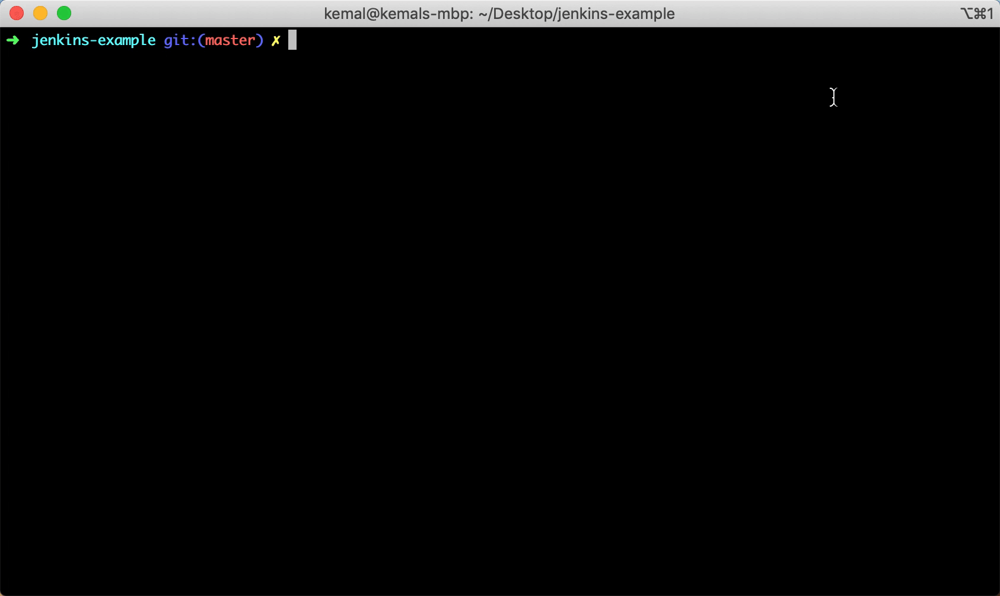
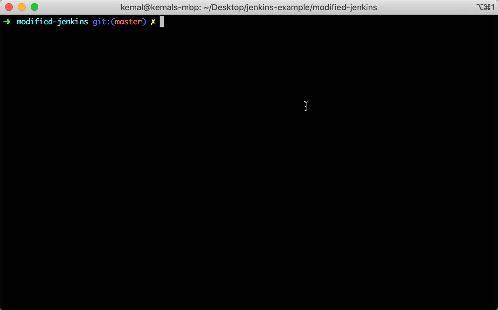
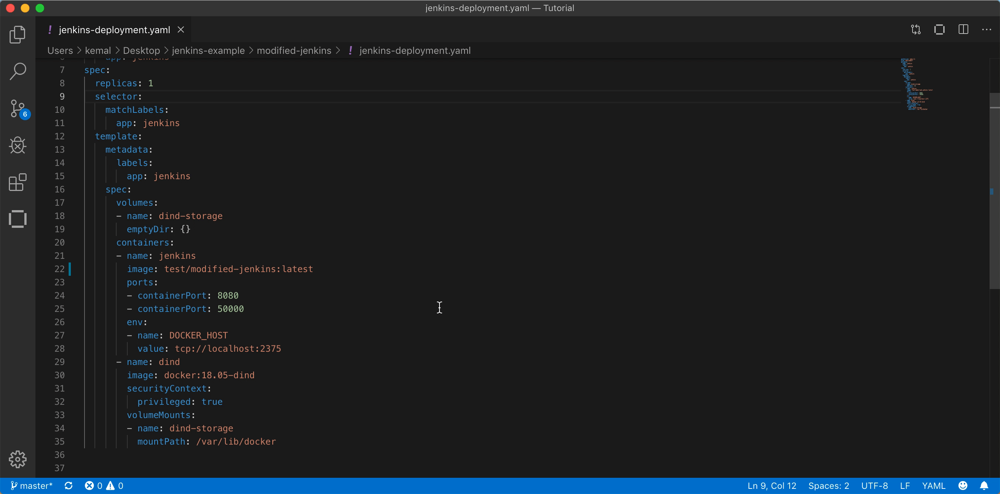
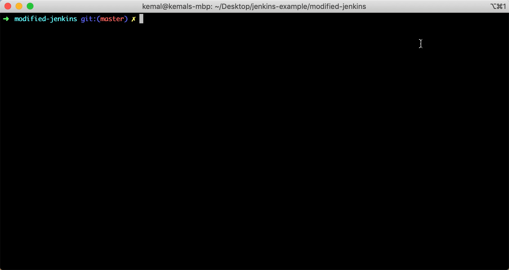

# Configuring CI/CD on Kubernetes with Jenkins

### Brief Description
In this tutorial, developers will learn: 
* Setting up a Jenkins environment on Kubernetes
* Configuring a CI/CD Jenkins pipeline
* Building Docker images using Jenkins 
* Pushing Docker images to Docker registry
* Deploying Docker images to Kubernetes environment
* Integrating Slack and Jenkins
* Integrating Github and Jenkins using Github webhooks

### What is Jenkins?
Jenkins is a self-contained, open source automation server which can be used to automate all sorts of tasks related to building, testing, and delivering or deploying software. Jenkins can be installed through native system packages, Docker, or even run standalone by any machine with a Java Runtime Environment (JRE) installed.

### What is Docker?
Docker is a tool designed to make it easier to create, deploy, and run applications by using containers. Containers allow a developer to package up an application with all of the parts it needs, such as libraries and other dependencies, and ship it all out as one package. By doing so, thanks to the container, the developer can rest assured that the application will run on any other Linux machine regardless of any customized settings that machine might have that could differ from the machine used for writing and testing the code.

### What is Kubernetes?
Kubernetes is a portable, extensible, open-source platform for automating deployment, scaling and managing containerized workloads and services, that facilitates both declarative configuration and automation. It has a large, rapidly growing ecosystem. Kubernetes services, support, and tools are widely available.

## Prerequisites
* [IBM Cloud Account](https://cloud.ibm.com)
* [IBM Cloud CLI](https://cloud.ibm.com/docs/cli?topic=cloud-cli-install-ibmcloud-cli)
* [Docker](https://www.docker.com/)
* [Docker Hub Account](https://hub.docker.com)
* [Kubernetes CLI](https://kubernetes.io/docs/tasks/tools/install-kubectl/)
* [Git Client](https://git-scm.com/downloads)
* [GitHub Account](https://github.com)
* [Slack Account](https://slack.com)

> **(Optional) Note:** The following command will install the IBM Cloud Developer Tools(IBM Cloud CLI, Kubernetes CLI(kubectl), Docker CLI and Git CLI) in a single invocation. Open up a terminal and run the following command:

```
$ curl -sL https://ibm.biz/idt-installer | bash
```

## Steps
Follow these steps to setup and run this tutorial.

1. [Create a Kubernetes Cluster on IBM Cloud](#1-create-a-kubernetes-cluster-on-ibm-cloud)
2. [Build a Modified Jenkins Image](#2-build-a-modified-jenkins-image)
3. [Deploy Modified Jenkins Image to Kubernetes](#3-deploy-modified-jenkins-image-to-kubernetes)
4. [Set up Jenkins Environment](#4-set-up-jenkins-environment)
5. [Create the First Jenkins Pipeline](#5-create-the-first-jenkins-pipeline)
6. [Integrate Jenkins and Slack](#6-integrate-jenkins-and-slack)
7. [Integrate Jenkins and GitHub](#7-integrate-jenkins-and-github)
8. [Test the First Jenkins Pipeline](#8-test-the-first-jenkins-pipeline)

### 1. Create a Kubernetes Cluster on IBM Cloud
Login to IBM Cloud and choose the `'Kubernetes'` option from Navigation Menu. After that, click on `'Create Cluster'` button and select the `'Free'` plan.

>**Note:** This process will take approximately 40 minutes.


### 2. Build a Modified Jenkins Image
Early on, Jenkins is designed to run on physical machines without any containerization technology. As containerization technologies become very popular, Jenkins also adapted its solution to the new containerized world. But this adaption brought some challenges. For instance, Jenkins requires Docker to build Docker images. But containerized version of Jenkins does not contain Docker and Docker CLI by default. For this reason, a new Docker image that contains Docker CLI and other tools should be created by using Jenkins image as base image.

>**Note:** This Dockerfile builds a modified Jenkins image that contains Docker CLI and Kubernetes CLI(kubectl).

>**Note:** The mofidied Jenkins image does not contain Docker Daemon. Docker Daemon will run in another container. Jenkins image will refer to that Docker Daemon container. (See: [Docker in Docker](https://hub.docker.com/_/docker))

```
FROM jenkins/jenkins:lts

USER root

ENV DOCKERVERSION=18.03.1-ce

RUN curl -fsSLO https://download.docker.com/linux/static/stable/x86_64/docker-${DOCKERVERSION}.tgz \
  && tar xzvf docker-${DOCKERVERSION}.tgz --strip 1 \
                 -C /usr/local/bin docker/docker \
  && rm docker-${DOCKERVERSION}.tgz

RUN curl -LO https://storage.googleapis.com/kubernetes-release/release/$(curl -s https://storage.googleapis.com/kubernetes-release/release/stable.txt)/bin/linux/amd64/kubectl \
	&& chmod +x ./kubectl \
	&& mv ./kubectl /usr/local/bin/kubectl
```
* Open a terminal and navigate to the `'modified-jenkins'` directory.

```
cd modified-jenkins
```

* Run the following command to build modified Jenkins image.
>**Note:** Replace the `'kmlaydin'` with your Docker Hub username.

```
docker build -t kmlaydin/modified-jenkins:latest .
```



### 3. Deploy Modified Jenkins Image to Kubernetes
Modified Jenkins image is built successfully. But it is in the local environment now. Kubernetes can not access to the local images. This is where Docker Hub gets on the stage. Docker Hub is a cloud-based repository in which Docker users and partners create, test, store and distribute container images. Modified Jenkins image is needed to push to Docker Hub or other container registries like [IBM Cloud Container Registry](https://www.ibm.com/cloud/container-registry). Docker uses Docker Hub by default.

* Run the following command to login to Docker Hub via the terminal.

```
docker login
```

* Run the following command to push the modified Jenkins image to Docker Hub. 

>**Note:** Replace the `'kmlaydin'` with your Docker Hub username.

```
docker push kmlaydin/modified-jenkins:latest
```



Pushed image can be seen via [Docker Hub](https://hub.docker.com/). Now, Kubernetes can access the image conveniently. Kubernetes works with YAML files to handle configurations.(See: [YAML basics in Kubernetes](https://developer.ibm.com/tutorials/yaml-basics-and-usage-in-kubernetes/)).

* Open the `'jenkins-deployment.yaml'` file which is located in the `'modified-jenkins'` directory with a code editor.
* Find the `'kmlaydin/modified-jenkins:latest'` part and replace the Docker Hub username, pushed image's name and version.



Deployment file is ready to deploy modified jenkins to Kubernetes.

* Open the dashboard of Kubernetes cluster which is created in step 1.
* Navigate to the `'Access'` tab.
* Run the commands to gain access to Kubernetes cluster via terminal.


* Run the following commands to deploy the modified Jenkins to Kubernetes. 

>**Note:** Make sure that the directory is `'modified-jenkins'`.

```
kubectl apply -f jenkins-deployment.yaml
```
```
kubectl apply -f jenkins-service.yaml
```

* Run the following command to make sure that Jenkins is deployed and in the running status.
>**Note:** Deployment process can take a couple of minutes.

```
kubectl get deployment,pod,service
```



* Run the following commands to get external IP of your worker node to gain access to Jenkins dashboard.

```
$ export EXTERNAL_IP=$(kubectl get nodes -o jsonpath='{.items[0].status.addresses[?(@.type=="ExternalIP")].address }')
```

```
$ export NODE_PORT=30100
```

```
$ echo $EXTERNAL_IP:$NODE_PORT
```


### 4. Set up Jenkins Environment
Jenkins assigns the initial admin password. This password can be found by logging Jenkins container.

* Run the following command to get logs of Jenkins container.

>**Note:** The initial admin password can be found between stars.

```
kubectl logs $(kubectl get pods --selector=app=jenkins -o=jsonpath='{.items[0].metadata.name}') jenkins
```

>**Note:** Installing suggested plugins can take a couple of minutes.
* Select the `'Install suggested plugins'` option. 

* Select the `'Continue as admin'` option. 

* Click the `'Save and Finish'` button. 

Jenkins is ready to use.


Jenkins needs some credentials to fulfil a duty conveniently. Those credentials are needed by Jenkins to run properly,

* `'GitHub'` credentials to gain access to source code.
* `'DockerHub'` credentials to push built image to DockerHub.
* `'Kubeconfig'` file to gain access to Kubernetes cluster.

`'GitHub'` and `'DockerHub'` credentials are kind of `'Username with password'`. But `'Kubeconfig'` credential is type of `'Secret file'`. Remember in step 3, Kubeconfig file is downloaded and exported as environment variable to local computer.

* Run the following command to go to the `'Kubeconfig'` directory of that Kubernetes cluster.

>**Note**: KUBECONFIG environment variable should be set before running this command.(See: [Deploy Modified Jenkins Image to Kubernetes](#3-deploy-modified-jenkins-image-to-kubernetes))
```
$ cd $(echo $KUBECONFIG | awk '{split($0,a,"kube-config"); print a[1];}') && ls
```
There should be two files in the directory.

* `'<PEM-FILE>.pem'` file that stands for Privacy-Enhanced Mail is a file format for storing and sending cryptographic keys, certificates, and other data.

* `'<KUBE-CONFIG>.yml'` file that is used to configure access to a cluster is sometimes called a kubeconfig file. This is a generic way of referring to configuration files.

Regarding to reference of `'<KUBE-CONFIG>.yml'` file to `'<PEM-FILE>.pem'` file, those two should be in the same directory. Nevertheless in Jenkins, there is no option to keep these two files in the same directory. For this reason, `'<PEM-FILE>.pem'` file should be embedded to `'<KUBE-CONFIG>.yml'` file.

* Run the following command to copy those files in to the `'Desktop'` directory.
>**Note**: Copying process is not obligatory. This is done due to preservation of original files. 

>**Note**: Run this command in the directory that contains `'<PEM-FILE>.pem'` file and `'<KUBE-CONFIG>.yml'` file.

>**Note**: Destination directory can be changed by editing `'/Users/$USER/Desktop'` part.

```
$ for file in ./*; do cp $file /Users/$USER/Desktop; done;
```

Go to the `'Desktop'` directory via terminal.

* Run the following command to encode `'<PEM-FILE>.pem'` file as base64.

```
$ base64 <PEM-FILE>.pem
```

Copy the result and open the `'<KUBE-CONFIG>.yml'` file with a code editor. Find the `'certificate-authority: <PEM-FILE>.pem'` part and change it as `'certificate-authority-data: <BASE64-RESULT>'`.


After this phase, `'<KUBE-CONFIG>.yml'` does not need `'<PEM-FILE>.pem'` file. Because it contains `'<PEM-FILE>.pem'` file.

Go back to the Jenkins' dashboard and find the `'Credentials'` option in the left pane. After that, select the `'(global)'` option. Now, credentials can be added by clicking `'Add Credentials'` button in the left pane.

* Add `'GitHub'` credentials as `'Username with password'` with ID `'github'`.
* Add `'DockerHub'` credentials as `'Username with password'` with ID `'dockerhub'`.
* Add `'Kubeconfig'` credentials as `'Secret file'` with ID `'kubeconfig'`.

Credentials are ready to use. Now that, some plugins should be installed. Jenkins has a wide range of plugin option.

>**Note:** Kubernetes CLI plugin is not mandatory. However, it eases the process.

[Kubernetes CLI](https://plugins.jenkins.io/kubernetes-cli) allows you to configure `'kubectl'` in your job to interact with Kubernetes clusters.

Go back to the Jenkins' dashboard and find the `'Manage Jenkins'` option in the left pane. After that, select the `'Manage Plugins'` option and choose the `'Available'` tab. There should be lots of available plugins in that tab. Search for the `'Kubernetes CLI'` plugin and install it.

Jenkins is ready for the first landing!

### 5. Create the First Jenkins Pipeline

>**Note:** In this step, a GitHub account that contains example files is needed. Example files are `'deployment.yaml'`, `'Dockerfile'`, `'index.js'`, `'Jenkinsfile'` and `'service.yaml'`.

Go back to the Jenkins' dashboard and find the `'New Item'` option in the left pane. Enter an item name and choose `'Pipeline'` option.

>**Note:** Example project url is `'https://github.com/kemallaydin/jenkins-example'`.
* Choose `'GitHub project'` and type your project's url.
* Find the `'Pipeline'` section and change the definition value from `'Pipeline script'` to `'Pipeline script from SCM'`.
* Choose the `'SCM'` as `'Git'`.
>**Note:** Example repository url is `'https://github.com/kemallaydin/jenkins-example.git'`.
* Type your repository URL and choose the `'Github'` credentials.


### 6. Integrate Jenkins and Slack

Jenkins needs `'Slack Plugin'` to post notifications to a Slack channel.

Go back to the Jenkins' dashboard and find the `'Manage Jenkins'` option in the left pane. After that, select the `'Manage Plugins'` option and choose the `'Available'` tab. Search for the `'Slack Notification'` plugin and install it.

After installing the plugin, instructions for Slack should be configured.

* Get a Slack account: [Slack](https://slack.com/)
* Configure the Jenkins integration by using Jenkins CI: [Jenkins CI](https://my.slack.com/services/new/jenkins-ci)

After configuration, click on `'Manage Jenkins'` again in the left navigation, and then go to `'Configure System'`. Find the `'Slack'` section and add the following values:
* **`Workspace`**: \<TEAM-SUBDOMAIN>
>**Note:** Create a secret text credential by clicking `'Add'` button.
* **`Credential`**: \<INTEGRATION-TOKEN-CREDENTIAL-ID>
* **`Default channel / member id`**: \<CHANNEL-NAME>

Jenkins and Slack integration can be tested by clicking `'Test Connection'` button.


### 7. Integrate Jenkins and GitHub

Webhooks allow external services to be notified when certain events happen. When the specified events happen, GitHub will send a POST request to Jenkins. Learn more in GitHub's [Webhooks Guide](https://developer.github.com/webhooks/).

Go to your project repository on `GitHub`. Click on the `Settings` option in the right corner. Find the `Webhooks` option in the left pane. Click on `Add webhook` button. The payload URL is `http://<JENKINS-URL>:<JENKINS-PORT>/github-webhook/`

>**Note:** Example payload URL is `http://169.47.252.31:30100/github-webhook/`

Save the webhook. 

After GitHub webhook configuration, GitHub will send specified events to Jenkins. Now, Jenkins should be configured to accept those events.

Go to the first pipeline's dashboard and click on `'Configure'` option in the left pane. Choose the `'GitHub hook trigger for GITScm polling'` option under the `'Build Triggers'` section and save the configuration.

>**Note:** <u>Pipeline should be triggered manually once</u> to be identified Jenkinsfile steps by Jenkins. After that, GitHub wekbooks can trigger the pipeline.


### 8. Test the First Jenkins Pipeline 

Jenkins is ready to test. Go to the first pipeline's dashboard and click on `'Build Now'` button. The steps that are defined in Jenkinsfile can be seen visually. After that, make a trivial change on `'index.js'` and push it to `GitHub`. You will see that pipeline is triggered by GitHub.

>**Note:** Jenkins deploys a sample NodeJS application to Kubernetes. Application can be seen via `http://<JENKINS-URL>:30300/getpodinfo`


Run the following command to watch the changes in Kubernetes while building process is running.

```
kubectl get pods -w
```

>**Note:** In this video, replica size is increased from 1 to 10. To test it modify the `'deployment.yaml'`.

